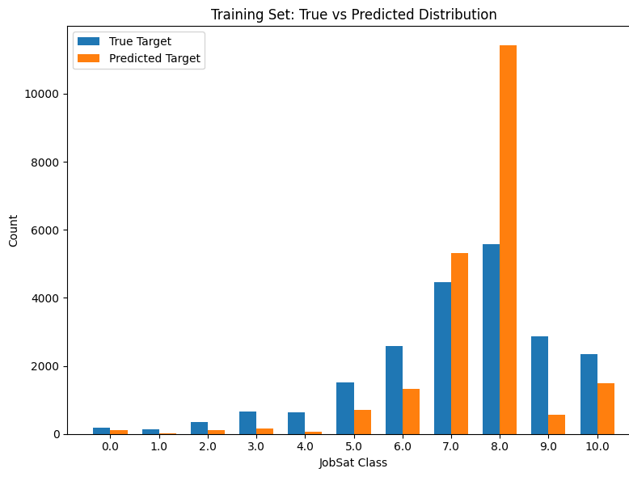

# Job Satisfaction Ordinal Modeling

Ordinal classification and feature-engineering workflow for predicting developer job satisfaction from survey responses.

## Preview

## Project summary

This project builds an ordinal logistic regression pipeline to predict `JobSat` from Stack Overflow survey data. The notebook includes data cleaning, missing-value handling, encoding of single-response and multi-response survey fields, feature engineering, feature selection, cross-validation, grid search, and final model evaluation.

## Problem

This project uses the 2025 Stack Overflow Annual Developer Survey to build a supervised classification model that predicts a respondent's self-reported job satisfaction.

> The target variable is `QID26` / `JobSat`, defined as "How satisfied are you in your current professional developer role?" Because job satisfaction is an ordered response rather than a continuous variable, the selected model is ordinal logistic regression. The modeling workflow also includes data cleaning, feature engineering, feature selection, model validation, hyperparameter tuning, performance comparison, and interpretation of domain-specific insights.

## Data

- Stack Overflow survey responses
- target label: `JobSat`
- mixed feature types, including numeric columns, single-response categorical columns, and multi-response columns

## Techniques

- train/test splitting with leakage-aware preprocessing
- missing-value imputation and column dropping
- multi-hot encoding for multi-response survey fields
- chi-square feature ranking
- engineered features
- ordinal logistic regression
- k-fold cross-validation
- bias-variance analysis
- grid search tuning

## Achievements

- split the survey data into training and test sets with preprocessing decisions learned from the training set
- handled categorical missingness with an `Unknown` category, removed numerical columns with more than 70% missingness, and median-imputed the remaining numerical fields
- encoded single-response survey fields with one-hot encoding and multi-response fields with multi-hot encoding, producing aligned train/test feature matrices
- engineered `ExperienceGap`, `CompPerYearExp`, and `ConsideringCareerChange`; the final selection retained `CompPerYearExp` and `ConsideringCareerChange`
- reduced the feature space to 199 predictors through Elastic Net feature selection
- implemented and tuned ordinal logistic regression; the final grid-search setting used `C=5` and `max_iter=500`
- evaluated the final model with train/test accuracy, macro F1, true-versus-predicted label distributions, and feature-importance analysis
- identified career-transition intention, compensation relative to experience, employment context, and AI-related perceptions as important factors associated with `JobSat`

## Repository structure

| File | Role |
| --- | --- |
| `xu_1007901512_assignment2.ipynb` | Main modeling notebook |
| `xu_1007901512_assignment2.pdf` | Exported report version of the notebook |
| `preview_training_prediction_distribution.png` | Training-set true vs predicted `JobSat` distribution |
| `preview_feature_importance.png` | Top features in the tuned ordinal model |
| `preview_bias_variance.png` | Bias-variance visualization for regularization |

## Skills practiced

This project practices supervised ordinal classification, leakage-aware preprocessing, high-dimensional categorical encoding, multi-response survey handling, feature engineering, feature selection, cross-validation, grid search, and model interpretability.
