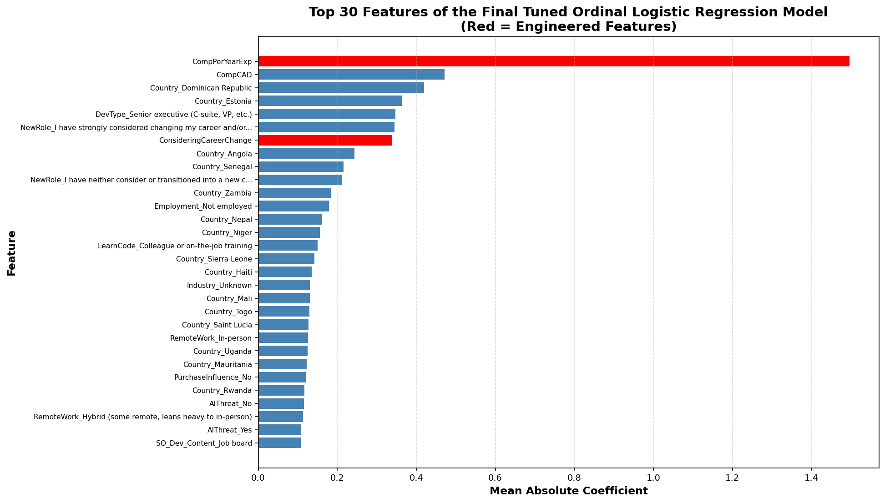
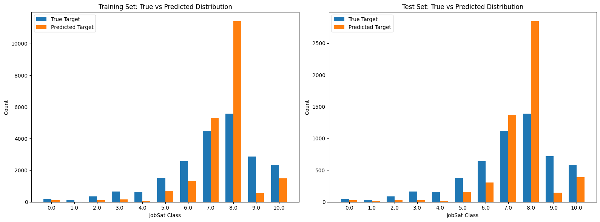

# Job Satisfaction Ordinal Modeling

Ordinal classification and feature-engineering workflow for predicting developer job satisfaction from survey responses.

## Preview

<table>
  <tr>
    <td width="50%">
      
    </td>
    <td width="50%">
      
    </td>
  </tr>
</table>

## Project summary

This project builds an ordinal logistic regression pipeline to predict `JobSat` from Stack Overflow survey data. The notebook includes data cleaning, missing-value handling, encoding of single-response and multi-response survey fields, feature engineering, feature selection, cross-validation, grid search, and final model evaluation.

## Problem

The objective of this machine learning analysis is to predict developer job satisfaction (`JobSat`) using the Stack Overflow Developer Survey.

> Because job satisfaction is measured as an ordinal outcome rather than as a continuous variable, the analysis is treated as an ordinal classification task. Beyond building a predictive model, the analysis also aims to identify which survey attributes are most strongly associated with job satisfaction and to evaluate how reliably these patterns generalize from the training data to unseen test data.

## Data

- Stack Overflow survey responses
- target label: `JobSat`
- mixed feature types, including numeric columns, single-response categorical columns, and multi-response columns

## Techniques

- train/test splitting with leakage-aware preprocessing
- missing-value imputation and column dropping
- multi-hot encoding for multi-response survey fields
- chi-square feature ranking
- engineered features
- ordinal logistic regression
- k-fold cross-validation
- bias-variance analysis
- grid search tuning

## Key outputs

- cleaned and encoded feature matrices
- selected feature set from feature engineering and selection
- cross-validation accuracy results
- tuned model hyperparameters
- final test classification report
- feature-importance ranking for the final model

## Repository structure

| File | Role |
| --- | --- |
| `xu_1007901512_assignment2.ipynb` | Main modeling notebook |
| `xu_1007901512_assignment2.pdf` | Exported report version of the notebook |
| `preview_feature_importance.png` | Top features in the tuned ordinal model |
| `preview_prediction_distribution.png` | True vs predicted class distribution |
| `preview_bias_variance.png` | Bias-variance visualization for regularization |

## Notes

The notebook keeps the modeling story centered on prediction quality and interpretability rather than raw leaderboard performance. That makes it a better fit for a portfolio repository.
